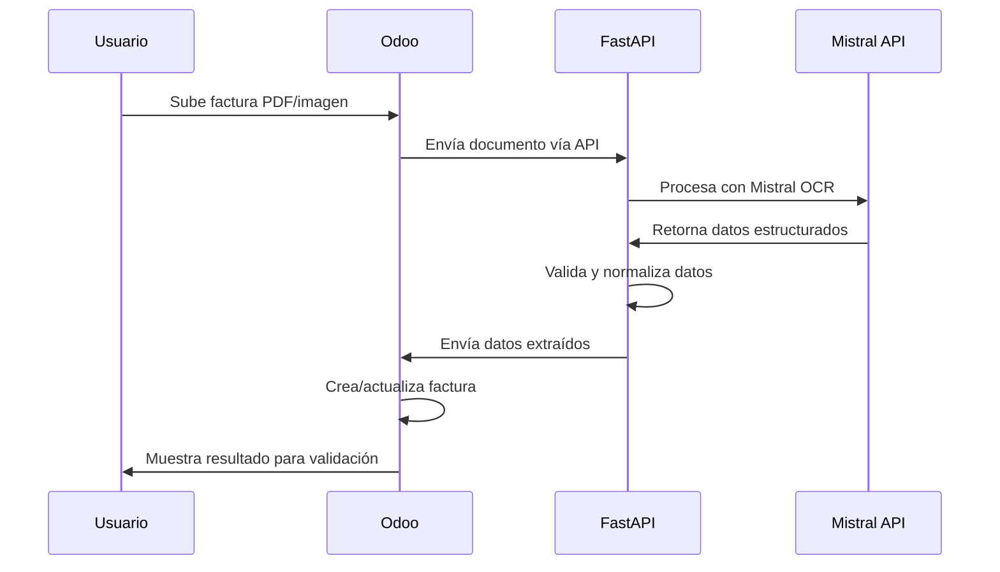

# Plan de Integración OCR-Mistral para Odoo 18

## 1. Resumen Ejecutivo

Este documento presenta un plan completo para integrar la API de OCR de Mistral AI con Odoo 18, creando un módulo personalizado para el reconocimiento y extracción automática de datos de facturas de proveedores. La solución aprovecha las capacidades avanzadas de Mistral OCR mientras se integra perfectamente con la arquitectura existente del proyecto basada en FastAPI como middleware.

### 1.1 Objetivos Principales

- **Automatización completa**: Eliminar la entrada manual de datos de facturas de proveedores
- **Precisión superior**: Aprovechar la precisión del 94.89% de Mistral OCR vs. competidores
- **Integración nativa**: Crear un módulo personalizado que se integre perfectamente con Odoo 18
- **Escalabilidad**: Procesar hasta 2,000 páginas por minuto con capacidad de procesamiento por lotes
- **Multilingüe**: Soporte nativo para múltiples idiomas con 99%+ de precisión
- **Costo-efectivo**: 1,000 páginas por $1 USD, significativamente más económico que servicios IAP de Odoo

## 2. Análisis Comparativo: Mistral OCR vs. Soluciones Existentes

### 2.1 Ventajas de Mistral OCR sobre Módulos Nativos de Odoo

| Característica | Mistral OCR | Módulos Odoo Nativos | Módulos Terceros |
|---|---|---|---|
| **Precisión General** | 94.89% | ~85-90% | ~85-92% |
| **Precisión Matemática** | 94.29% | ~80% | ~85% |
| **Multilingüe** | 99%+ (11+ idiomas) | Limitado | Variable |
| **Velocidad** | 2,000 pág/min | ~100-500 pág/min | ~200-800 pág/min |
| **Costo** | $1/1000 páginas | IAP: $3-5/1000 | €90-127 licencia |
| **Extracción de Imágenes** | ✅ Nativo | ❌ | ❌ |
| **Salida Estructurada** | JSON/Markdown | Limitado | Básico |
| **Doc-as-Prompt** | ✅ Avanzado | ❌ | ❌ |
| **Tablas Complejas** | ✅ Excelente | ⚠️ Básico | ⚠️ Limitado |
| **Fórmulas Matemáticas** | ✅ Nativo | ❌ | ❌ |

### 2.2 Análisis de Módulos Existentes de Odoo

**Módulos Nativos de Odoo:**
- `account_invoice_extract`: Servicio IAP que requiere créditos prepagos
- Limitado a formatos básicos y precisión moderada
- Dependiente de servicios externos de Odoo

**Módulos de Terceros Identificados:**
- `invoice_ocr_extractor`: €90, usa Tesseract OCR
- `dx_account_invoice_digitization`: €120, requiere OpenAI API
- `account_invoice_digitization`: €127, funcionalidad básica

**Limitaciones Identificadas:**
- Dependencia de Tesseract OCR (menor precisión)
- Costos de licencia adicionales
- Funcionalidad limitada para documentos complejos
- Sin capacidad de extracción de imágenes embebidas

## 3. Arquitectura de la Solución

### 3.1 Integración con Arquitectura Existente

La solución se integra perfectamente con la arquitectura de tres capas ya definida en el proyecto:

```
┌─────────────────┐     ┌─────────────────────────┐     ┌─────────────────┐
│                 │     │                         │     │                 │
│  Frontend       │     │  Middleware             │     │  Backend        │
│  (Refine/React) │◄───►│  (FastAPI)             │◄───►│  (Odoo 18)      │
│                 │     │                         │     │                 │
└─────────────────┘     └─────────────────────────┘     └─────────────────┘
                              ▲           ▲
                              │           │
                              ▼           ▼
                        ┌─────────┐ ┌────────────┐
                        │ Mistral │ │  TVP       │
                        │   OCR   │ │  Service   │
                        │ Service │ │            │
                        └─────────┘ └────────────┘
```

### 3.2 Componentes del Sistema

#### 3.2.1 Módulo Odoo Personalizado: `mistral_invoice_ocr`

**Estructura del Módulo:**
```
mistral_invoice_ocr/
├── __manifest__.py
├── models/
│   ├── __init__.py
│   ├── account_move.py          # Extensión del modelo de facturas
│   ├── mistral_ocr_config.py    # Configuración de Mistral API
│   └── ocr_extraction_log.py    # Log de extracciones
├── views/
│   ├── account_move_views.xml   # Vistas extendidas
│   ├── mistral_config_views.xml # Configuración
│   └── ocr_log_views.xml        # Logs
├── wizards/
│   ├── __init__.py
│   └── invoice_ocr_wizard.py    # Asistente de procesamiento
├── static/
│   └── src/
│       └── js/
│           └── invoice_ocr.js   # JavaScript para UI
├── security/
│   └── ir.model.access.csv      # Permisos
└── data/
    └── mistral_config_data.xml  # Datos iniciales
```

#### 3.2.2 Servicio FastAPI: Mistral OCR Integration

**Endpoints Principales:**
```python
# /api/v1/ocr/
POST /process-invoice          # Procesar factura individual
POST /batch-process           # Procesamiento por lotes
GET  /extraction-status/{id}  # Estado de extracción
POST /validate-extraction     # Validar y corregir datos
GET  /supported-languages     # Idiomas soportados
```

### 3.3 Flujo de Procesamiento



## 4. Especificaciones Técnicas

### 4.1 Integración con Mistral API

#### 4.1.1 Configuración de API

```python
# Configuración en FastAPI
class MistralOCRConfig:
    API_KEY: str = os.getenv("MISTRAL_API_KEY")
    BASE_URL: str = "https://api.mistral.ai/v1/ocr"
    MODEL: str = "mistral-ocr-latest"
    MAX_PAGES_PER_REQUEST: int = 50
    TIMEOUT: int = 300
    RETRY_ATTEMPTS: int = 3
```

#### 4.1.2 Estructura de Request

```python
# Payload para Mistral OCR
request_payload = {
    "model": "mistral-ocr-latest",
    "documents": [
        {
            "type": "pdf",  # o "image"
            "content": base64_encoded_content,
            "filename": "factura_001.pdf"
        }
    ],
    "output_format": "json",
    "extract_images": True,
    "language": "es",  # Español
    "structured_output": {
        "type": "invoice",
        "fields": [
            "invoice_number", "date", "due_date",
            "vendor_name", "vendor_vat", "vendor_address",
            "total_amount", "tax_amount", "subtotal",
            "line_items", "payment_terms"
        ]
    }
}
```

#### 4.1.3 Procesamiento de Respuesta

```python
# Estructura de respuesta esperada
response_structure = {
    "extraction_id": "uuid",
    "status": "completed",
    "confidence_score": 0.95,
    "extracted_data": {
        "invoice_number": "FAC-2024-001",
        "date": "2024-01-15",
        "due_date": "2024-02-15",
        "vendor": {
            "name": "Proveedor SA",
            "vat": "B12345678",
            "address": "Calle Principal 123, Madrid"
        },
        "amounts": {
            "subtotal": 1000.00,
            "tax_amount": 210.00,
            "total": 1210.00
        },
        "line_items": [
            {
                "description": "Producto A",
                "quantity": 2,
                "unit_price": 500.00,
                "total": 1000.00
            }
        ]
    },
    "extracted_images": [
        {
            "type": "logo",
            "content": "base64_image_data",
            "position": {"x": 100, "y": 50}
        }
    ]
}
```

### 4.2 Modelos de Datos en Odoo

#### 4.2.1 Extensión del Modelo account.move

```python
class AccountMove(models.Model):
    _inherit = 'account.move'
    
    # Campos para OCR
    ocr_extraction_id = fields.Char('ID de Extracción OCR')
    ocr_confidence_score = fields.Float('Puntuación de Confianza OCR')
    ocr_status = fields.Selection([
        ('pending', 'Pendiente'),
        ('processing', 'Procesando'),
        ('completed', 'Completado'),
        ('error', 'Error'),
        ('manual_review', 'Revisión Manual')
    ], string='Estado OCR', default='pending')
    ocr_extracted_data = fields.Text('Datos Extraídos (JSON)')
    ocr_original_document = fields.Binary('Documento Original')
    ocr_extracted_images = fields.Text('Imágenes Extraídas (JSON)')
    ocr_processing_time = fields.Float('Tiempo de Procesamiento (seg)')
    ocr_error_message = fields.Text('Mensaje de Error OCR')
    
    # Campos de validación
    requires_manual_validation = fields.Boolean('Requiere Validación Manual')
    validation_notes = fields.Text('Notas de Validación')
    validated_by = fields.Many2one('res.users', 'Validado por')
    validation_date = fields.Datetime('Fecha de Validación')
```

#### 4.2.2 Modelo de Configuración

```python
class MistralOCRConfig(models.Model):
    _name = 'mistral.ocr.config'
    _description = 'Configuración de Mistral OCR'
    
    name = fields.Char('Nombre', required=True)
    api_key = fields.Char('API Key de Mistral', required=True)
    model_name = fields.Char('Modelo', default='mistral-ocr-latest')
    default_language = fields.Selection([
        ('es', 'Español'),
        ('en', 'Inglés'),
        ('fr', 'Francés'),
        ('de', 'Alemán'),
        ('it', 'Italiano'),
        ('pt', 'Portugués')
    ], string='Idioma por Defecto', default='es')
    
    # Configuraciones de procesamiento
    max_pages_per_request = fields.Integer('Máx. Páginas por Solicitud', default=50)
    confidence_threshold = fields.Float('Umbral de Confianza', default=0.85)
    auto_validate_threshold = fields.Float('Umbral Auto-validación', default=0.95)
    
    # Configuraciones de integración
    fastapi_endpoint = fields.Char('Endpoint FastAPI', required=True)
    timeout_seconds = fields.Integer('Timeout (segundos)', default=300)
    retry_attempts = fields.Integer('Intentos de Reintento', default=3)
    
    active = fields.Boolean('Activo', default=True)
```

### 4.3 Servicios FastAPI

#### 4.3.1 Servicio Principal de OCR

```python
class MistralOCRService:
    def __init__(self, config: MistralOCRConfig):
        self.config = config
        self.client = httpx.AsyncClient(
            base_url=config.BASE_URL,
            headers={"Authorization": f"Bearer {config.API_KEY}"},
            timeout=config.TIMEOUT
        )
    
    async def process_invoice(self, document: bytes, filename: str, 
                            language: str = "es") -> Dict:
        """Procesa una factura usando Mistral OCR"""
        
        # Preparar payload
        payload = self._prepare_payload(document, filename, language)
        
        # Enviar a Mistral API
        response = await self._send_to_mistral(payload)
        
        # Procesar respuesta
        processed_data = self._process_response(response)
        
        # Validar datos extraídos
        validated_data = self._validate_extracted_data(processed_data)
        
        return validated_data
    
    async def batch_process(self, documents: List[Dict]) -> List[Dict]:
        """Procesamiento por lotes"""
        tasks = []
        for doc in documents:
            task = self.process_invoice(
                doc['content'], 
                doc['filename'], 
                doc.get('language', 'es')
            )
            tasks.append(task)
        
        results = await asyncio.gather(*tasks, return_exceptions=True)
        return self._handle_batch_results(results)
    
    def _validate_extracted_data(self, data: Dict) -> Dict:
        """Valida y normaliza los datos extraídos"""
        validator = InvoiceDataValidator()
        
        # Validar campos obligatorios
        validation_result = validator.validate(data)
        
        # Normalizar formatos
        normalized_data = validator.normalize(data)
        
        # Calcular puntuación de confianza
        confidence_score = validator.calculate_confidence(normalized_data)
        
        return {
            'extracted_data': normalized_data,
            'validation_result': validation_result,
            'confidence_score': confidence_score,
            'requires_manual_review': confidence_score < self.config.confidence_threshold
        }
```

#### 4.3.2 Endpoints de API

```python
@router.post("/process-invoice")
async def process_invoice(
    file: UploadFile = File(...),
    language: str = Query("es", description="Idioma del documento"),
    current_user: User = Depends(get_current_active_user)
):
    """Procesa una factura individual"""
    
    try:
        # Validar archivo
        if not file.content_type in ['application/pdf', 'image/jpeg', 'image/png']:
            raise HTTPException(400, "Tipo de archivo no soportado")
        
        # Leer contenido
        content = await file.read()
        
        # Procesar con Mistral OCR
        ocr_service = MistralOCRService(get_mistral_config())
        result = await ocr_service.process_invoice(content, file.filename, language)
        
        # Guardar en base de datos
        extraction_log = await save_extraction_log(result, current_user.id)
        
        return {
            "extraction_id": extraction_log.id,
            "status": "completed",
            "data": result['extracted_data'],
            "confidence_score": result['confidence_score'],
            "requires_manual_review": result['requires_manual_review']
        }
        
    except Exception as e:
        logger.error(f"Error procesando factura: {str(e)}")
        raise HTTPException(500, f"Error interno: {str(e)}")

@router.post("/batch-process")
async def batch_process_invoices(
    files: List[UploadFile] = File(...),
    language: str = Query("es"),
    current_user: User = Depends(get_current_active_user)
):
    """Procesamiento por lotes de facturas"""
    
    if len(files) > 50:  # Límite de Mistral
        raise HTTPException(400, "Máximo 50 archivos por lote")
    
    # Preparar documentos
    documents = []
    for file in files:
        content = await file.read()
        documents.append({
            'content': content,
            'filename': file.filename,
            'language': language
        })
    
    # Procesar lote
    ocr_service = MistralOCRService(get_mistral_config())
    results = await ocr_service.batch_process(documents)
    
    # Guardar resultados
    batch_log = await save_batch_extraction_log(results, current_user.id)
    
    return {
        "batch_id": batch_log.id,
        "total_processed": len(results),
        "successful": len([r for r in results if r['status'] == 'success']),
        "failed": len([r for r in results if r['status'] == 'error']),
        "results": results
    }
```

## 5. Funcionalidades Avanzadas

### 5.1 Validación Inteligente de Datos

```python
class InvoiceDataValidator:
    def __init__(self):
        self.required_fields = [
            'invoice_number', 'date', 'vendor_name', 'total_amount'
        ]
        self.date_formats = [
            '%d/%m/%Y', '%d-%m-%Y', '%Y-%m-%d', '%d.%m.%Y'
        ]
    
    def validate(self, data: Dict) -> Dict:
        """Valida los datos extraídos"""
        errors = []
        warnings = []
        
        # Validar campos obligatorios
        for field in self.required_fields:
            if not data.get(field):
                errors.append(f"Campo obligatorio faltante: {field}")
        
        # Validar formato de fecha
        if data.get('date'):
            if not self._validate_date(data['date']):
                errors.append("Formato de fecha inválido")
        
        # Validar NIF/CIF
        if data.get('vendor_vat'):
            if not self._validate_vat(data['vendor_vat']):
                warnings.append("Formato de NIF/CIF posiblemente incorrecto")
        
        # Validar coherencia de importes
        if self._validate_amounts(data):
            warnings.append("Los importes no cuadran matemáticamente")
        
        return {
            'is_valid': len(errors) == 0,
            'errors': errors,
            'warnings': warnings
        }
    
    def _validate_vat(self, vat: str) -> bool:
        """Valida formato de NIF/CIF español"""
        import re
        # Patrón para NIF/CIF español
        pattern = r'^[A-Z]?[0-9]{8}[A-Z0-9]$'
        return bool(re.match(pattern, vat.upper().replace(' ', '')))
    
    def _validate_amounts(self, data: Dict) -> bool:
        """Valida coherencia de importes"""
        try:
            subtotal = float(data.get('subtotal', 0))
            tax_amount = float(data.get('tax_amount', 0))
            total = float(data.get('total_amount', 0))
            
            calculated_total = subtotal + tax_amount
            return abs(calculated_total - total) < 0.01
        except (ValueError, TypeError):
            return False
```

### 5.2 Mapeo Inteligente de Proveedores

```python
class VendorMappingService:
    def __init__(self, odoo_client):
        self.odoo = odoo_client
        self.similarity_threshold = 0.8
    
    async def find_or_create_vendor(self, extracted_vendor: Dict) -> int:
        """Encuentra o crea un proveedor basado en datos extraídos"""
        
        # Buscar por VAT exacto
        if extracted_vendor.get('vat'):
            vendor = await self._find_vendor_by_vat(extracted_vendor['vat'])
            if vendor:
                return vendor['id']
        
        # Buscar por similitud de nombre
        if extracted_vendor.get('name'):
            vendor = await self._find_vendor_by_similarity(extracted_vendor['name'])
            if vendor:
                return vendor['id']
        
        # Crear nuevo proveedor
        return await self._create_vendor(extracted_vendor)
    
    async def _find_vendor_by_similarity(self, name: str) -> Optional[Dict]:
        """Busca proveedor por similitud de nombre usando fuzzy matching"""
        from fuzzywuzzy import fuzz
        
        # Obtener todos los proveedores
        vendors = await self.odoo.search_read(
            'res.partner',
            [('is_company', '=', True), ('supplier_rank', '>', 0)],
            ['name', 'vat']
        )
        
        best_match = None
        best_score = 0
        
        for vendor in vendors:
            score = fuzz.ratio(name.lower(), vendor['name'].lower()) / 100
            if score > best_score and score >= self.similarity_threshold:
                best_score = score
                best_match = vendor
        
        return best_match
```

### 5.3 Procesamiento de Imágenes Extraídas

```python
class ImageProcessingService:
    def __init__(self):
        self.supported_types = ['logo', 'signature', 'stamp', 'chart', 'table']
    
    async def process_extracted_images(self, images: List[Dict], 
                                     invoice_id: int) -> List[Dict]:
        """Procesa las imágenes extraídas del documento"""
        processed_images = []
        
        for image_data in images:
            # Decodificar imagen
            image_bytes = base64.b64decode(image_data['content'])
            
            # Clasificar tipo de imagen
            image_type = self._classify_image(image_data, image_bytes)
            
            # Procesar según tipo
            if image_type == 'logo':
                processed = await self._process_logo(image_bytes, invoice_id)
            elif image_type == 'signature':
                processed = await self._process_signature(image_bytes, invoice_id)
            elif image_type == 'table':
                processed = await self._process_table_image(image_bytes, invoice_id)
            else:
                processed = await self._process_generic_image(image_bytes, invoice_id)
            
            processed_images.append(processed)
        
        return processed_images
    
    def _classify_image(self, metadata: Dict, image_bytes: bytes) -> str:
        """Clasifica el tipo de imagen basado en metadatos y contenido"""
        # Usar metadatos de Mistral si están disponibles
        if metadata.get('type') in self.supported_types:
            return metadata['type']
        
        # Clasificación básica por posición y tamaño
        position = metadata.get('position', {})
        if position.get('y', 0) < 100:  # Parte superior del documento
            return 'logo'
        elif position.get('y', 0) > 800:  # Parte inferior
            return 'signature'
        else:
            return 'generic'
```

## 6. Interfaz de Usuario

### 6.1 Vistas Extendidas en Odoo

#### 6.1.1 Vista de Factura con OCR

```xml
<!-- views/account_move_views.xml -->
<record id="view_move_form_ocr_enhanced" model="ir.ui.view">
    <field name="name">account.move.form.ocr</field>
    <field name="model">account.move</field>
    <field name="inherit_id" ref="account.view_move_form"/>
    <field name="arch" type="xml">
        <xpath expr="//header" position="inside">
            <button name="action_process_with_ocr" 
                    type="object" 
                    string="Procesar con OCR"
                    class="btn-primary"
                    attrs="{'invisible': [('ocr_status', 'in', ['processing', 'completed'])]}"/>
            
            <button name="action_validate_ocr_data" 
                    type="object" 
                    string="Validar Datos OCR"
                    class="btn-warning"
                    attrs="{'invisible': [('requires_manual_validation', '=', False)]}"/>
        </xpath>
        
        <xpath expr="//sheet" position="before">
            <div class="alert alert-info" 
                 attrs="{'invisible': [('ocr_status', '!=', 'processing')]}">
                <strong>Procesando con OCR...</strong>
                <p>El documento se está procesando. Esto puede tomar unos momentos.</p>
            </div>
            
            <div class="alert alert-success" 
                 attrs="{'invisible': [('ocr_status', '!=', 'completed')]}">
                <strong>OCR Completado</strong>
                <p>Confianza: <field name="ocr_confidence_score" widget="percentage"/></p>
            </div>
            
            <div class="alert alert-warning" 
                 attrs="{'invisible': [('requires_manual_validation', '=', False)]}">
                <strong>Requiere Validación Manual</strong>
                <p>Los datos extraídos requieren revisión manual.</p>
            </div>
        </xpath>
        
        <xpath expr="//field[@name='partner_id']" position="after">
            <field name="ocr_status" readonly="1"/>
            <field name="ocr_confidence_score" widget="percentage" readonly="1"
                   attrs="{'invisible': [('ocr_status', '!=', 'completed')]}"/>
        </xpath>
    </field>
</record>
```

#### 6.1.2 Asistente de Procesamiento OCR

```python
# wizards/invoice_ocr_wizard.py
class InvoiceOCRWizard(models.TransientModel):
    _name = 'invoice.ocr.wizard'
    _description = 'Asistente de Procesamiento OCR'
    
    document_file = fields.Binary('Documento', required=True)
    document_filename = fields.Char('Nombre del Archivo')
    language = fields.Selection([
        ('es', 'Español'),
        ('en', 'Inglés'),
        ('fr', 'Francés')
    ], string='Idioma', default='es', required=True)
    
    processing_mode = fields.Selection([
        ('single', 'Documento Individual'),
        ('batch', 'Procesamiento por Lotes')
    ], string='Modo de Procesamiento', default='single')
    
    auto_create_invoice = fields.Boolean('Crear Factura Automáticamente', default=True)
    confidence_threshold = fields.Float('Umbral de Confianza', default=0.85)
    
    def action_process_document(self):
        """Procesa el documento con OCR"""
        # Llamar al servicio FastAPI
        ocr_service = self.env['mistral.ocr.service']
        result = ocr_service.process_document(
            self.document_file,
            self.document_filename,
            self.language
        )
        
        if self.auto_create_invoice and result['confidence_score'] >= self.confidence_threshold:
            # Crear factura automáticamente
            invoice = self._create_invoice_from_ocr(result)
            return {
                'type': 'ir.actions.act_window',
                'res_model': 'account.move',
                'res_id': invoice.id,
                'view_mode': 'form',
                'target': 'current'
            }
        else:
            # Mostrar datos para validación manual
            return self._show_validation_wizard(result)
```

### 6.2 Dashboard de Monitoreo

```python
# models/ocr_dashboard.py
class OCRDashboard(models.Model):
    _name = 'ocr.dashboard'
    _description = 'Dashboard de OCR'
    _auto = False
    
    @api.model
    def get_ocr_statistics(self, date_from, date_to):
        """Obtiene estadísticas de OCR para el dashboard"""
        
        query = """
            SELECT 
                COUNT(*) as total_processed,
                AVG(ocr_confidence_score) as avg_confidence,
                COUNT(CASE WHEN requires_manual_validation THEN 1 END) as manual_reviews,
                COUNT(CASE WHEN ocr_status = 'error' THEN 1 END) as errors,
                AVG(ocr_processing_time) as avg_processing_time
            FROM account_move 
            WHERE ocr_extraction_id IS NOT NULL
            AND create_date BETWEEN %s AND %s
        """
        
        self.env.cr.execute(query, (date_from, date_to))
        result = self.env.cr.dictfetchone()
        
        return {
            'total_processed': result['total_processed'] or 0,
            'avg_confidence': round(result['avg_confidence'] or 0, 2),
            'manual_reviews': result['manual_reviews'] or 0,
            'errors': result['errors'] or 0,
            'avg_processing_time': round(result['avg_processing_time'] or 0, 2),
            'success_rate': round(
                ((result['total_processed'] - result['errors']) / 
                 max(result['total_processed'], 1)) * 100, 2
            )
        }
```

## 7. Plan de Implementación

### 7.1 Fase 1: Configuración Base (Semana 1-2)

**Objetivos:**
- Configurar cuenta de Mistral AI y obtener API key
- Crear estructura básica del módulo Odoo
- Implementar servicio básico en FastAPI

**Tareas:**
1. **Configuración de Mistral AI**
   - Registrar cuenta en Mistral AI
   - Obtener API key y configurar límites
   - Probar API con documentos de ejemplo

2. **Módulo Odoo Base**
   - Crear estructura de directorios
   - Implementar modelos básicos
   - Crear vistas iniciales
   - Configurar permisos de seguridad

3. **Servicio FastAPI**
   - Implementar endpoints básicos
   - Configurar cliente HTTP para Mistral
   - Crear sistema de logging

**Entregables:**
- Módulo Odoo instalable
- API funcional con endpoint básico
- Documentación de configuración

### 7.2 Fase 2: Funcionalidad Core (Semana 3-4)

**Objetivos:**
- Implementar procesamiento completo de facturas
- Crear sistema de validación de datos
- Desarrollar mapeo de proveedores

**Tareas:**
1. **Procesamiento de Documentos**
   - Implementar carga de archivos
   - Integrar con Mistral OCR API
   - Procesar respuestas y extraer datos

2. **Validación y Normalización**
   - Crear validadores de datos
   - Implementar normalización de formatos
   - Desarrollar sistema de confianza

3. **Integración con Odoo**
   - Mapeo automático de proveedores
   - Creación automática de facturas
   - Sistema de logs y auditoría

**Entregables:**
- Procesamiento completo de facturas
- Sistema de validación funcional
- Integración básica con Odoo

### 7.3 Fase 3: Funcionalidades Avanzadas (Semana 5-6)

**Objetivos:**
- Implementar procesamiento por lotes
- Desarrollar interfaz de usuario avanzada
- Crear sistema de monitoreo

**Tareas:**
1. **Procesamiento por Lotes**
   - Implementar carga múltiple de archivos
   - Optimizar procesamiento paralelo
   - Crear reportes de lotes

2. **Interfaz de Usuario**
   - Desarrollar asistentes de procesamiento
   - Crear vistas de validación manual
   - Implementar dashboard de monitoreo

3. **Funcionalidades Avanzadas**
   - Procesamiento de imágenes extraídas
   - Sistema de aprendizaje de patrones
   - Integración con workflows existentes

**Entregables:**
- Procesamiento por lotes funcional
- Interfaz de usuario completa
- Dashboard de monitoreo

### 7.4 Fase 4: Testing y Optimización (Semana 7-8)

**Objetivos:**
- Realizar testing exhaustivo
- Optimizar rendimiento
- Preparar documentación final

**Tareas:**
1. **Testing**
   - Pruebas unitarias de todos los componentes
   - Pruebas de integración
   - Pruebas de carga y rendimiento
   - Testing con documentos reales

2. **Optimización**
   - Optimizar consultas a base de datos
   - Mejorar tiempos de respuesta
   - Implementar caché donde sea necesario

3. **Documentación**
   - Manual de usuario
   - Documentación técnica
   - Guías de troubleshooting

**Entregables:**
- Sistema completamente testado
- Documentación completa
- Sistema listo para producción

## 8. Consideraciones de Seguridad

### 8.1 Protección de API Keys

```python
# Configuración segura de API keys
class SecureConfig:
    @staticmethod
    def get_mistral_api_key():
        # Usar variables de entorno o vault seguro
        api_key = os.getenv('MISTRAL_API_KEY')
        if not api_key:
            raise ValueError("MISTRAL_API_KEY no configurada")
        return api_key
    
    @staticmethod
    def encrypt_sensitive_data(data: str) -> str:
        # Encriptar datos sensibles antes de almacenar
        from cryptography.fernet import Fernet
        key = os.getenv('ENCRYPTION_KEY').encode()
        f = Fernet(key)
        return f.encrypt(data.encode()).decode()
```

### 8.2 Validación de Archivos

```python
class FileValidator:
    ALLOWED_TYPES = ['application/pdf', 'image/jpeg', 'image/png']
    MAX_FILE_SIZE = 50 * 1024 * 1024  # 50MB
    
    @staticmethod
    def validate_file(file: UploadFile) -> bool:
        # Validar tipo de archivo
        if file.content_type not in FileValidator.ALLOWED_TYPES:
            raise HTTPException(400, "Tipo de archivo no permitido")
        
        # Validar tamaño
        if file.size > FileValidator.MAX_FILE_SIZE:
            raise HTTPException(400, "Archivo demasiado grande")
        
        # Validar contenido (magic numbers)
        content = file.file.read(1024)
        file.file.seek(0)
        
        if not FileValidator._validate_magic_numbers(content, file.content_type):
            raise HTTPException(400, "Contenido de archivo inválido")
        
        return True
```

### 8.3 Auditoría y Logging

```python
class OCRAuditLog(models.Model):
    _name = 'ocr.audit.log'
    _description = 'Log de Auditoría OCR'
    
    user_id = fields.Many2one('res.users', 'Usuario', required=True)
    action = fields.Selection([
        ('upload', 'Subida de Documento'),
        ('process', 'Procesamiento OCR'),
        ('validate', 'Validación Manual'),
        ('create_invoice', 'Creación de Factura')
    ], string='Acción', required=True)
    
    document_name = fields.Char('Nombre del Documento')
    extraction_id = fields.Char('ID de Extracción')
    confidence_score = fields.Float('Puntuación de Confianza')
    processing_time = fields.Float('Tiempo de Procesamiento')
    
    ip_address = fields.Char('Dirección IP')
    user_agent = fields.Char('User Agent')
    
    result = fields.Selection([
        ('success', 'Éxito'),
        ('error', 'Error'),
        ('warning', 'Advertencia')
    ], string='Resultado')
    
    error_message = fields.Text('Mensaje de Error')
    additional_data = fields.Text('Datos Adicionales (JSON)')
```

## 9. Monitoreo y Métricas

### 9.1 KPIs del Sistema

```python
class OCRMetrics:
    @staticmethod
    def calculate_kpis(date_from, date_to):
        return {
            # Métricas de rendimiento
            'total_documents_processed': 0,
            'avg_processing_time': 0.0,
            'documents_per_hour': 0.0,
            
            # Métricas de calidad
            'avg_confidence_score': 0.0,
            'manual_validation_rate': 0.0,
            'error_rate': 0.0,
            
            # Métricas de negocio
            'time_saved_hours': 0.0,
            'cost_per_document': 0.0,
            'roi_percentage': 0.0,
            
            # Métricas técnicas
            'api_response_time': 0.0,
            'success_rate': 0.0,
            'retry_rate': 0.0
        }
```

### 9.2 Alertas y Notificaciones

```python
class OCRAlertSystem:
    def __init__(self):
        self.thresholds = {
            'error_rate': 0.05,  # 5%
            'avg_confidence': 0.80,  # 80%
            'processing_time': 30.0  # 30 segundos
        }
    
    def check_alerts(self):
        metrics = OCRMetrics.calculate_kpis(
            datetime.now() - timedelta(hours=1),
            datetime.now()
        )
        
        alerts = []
        
        if metrics['error_rate'] > self.thresholds['error_rate']:
            alerts.append({
                'type': 'error_rate_high',
                'message': f"Tasa de error alta: {metrics['error_rate']:.2%}",
                'severity': 'high'
            })
        
        if metrics['avg_confidence'] < self.thresholds['avg_confidence']:
            alerts.append({
                'type': 'confidence_low',
                'message': f"Confianza promedio baja: {metrics['avg_confidence']:.2%}",
                'severity': 'medium'
            })
        
        return alerts
```

## 10. Costos y ROI

### 10.1 Análisis de Costos

**Costos de Mistral OCR:**
- **Precio base**: $1 USD por 1,000 páginas
- **Procesamiento por lotes**: ~$0.50 USD por 1,000 páginas
- **Sin costos de setup o licencias**

**Comparación con alternativas:**

| Solución | Costo Inicial | Costo por 1000 pág | Precisión | Velocidad |
|----------|---------------|-------------------|-----------|----------|
| **Mistral OCR** | $0 | $1.00 | 94.89% | 2000 pág/min |
| Odoo IAP | $0 | $3-5 | ~85% | ~500 pág/min |
| Módulos Terceros | €90-127 | $0* | ~85-90% | ~200-800 pág/min |
| Tesseract (propio) | $0 | $0* | ~75-80% | ~100-300 pág/min |

*Costos de infraestructura y mantenimiento no incluidos

### 10.2 Cálculo de ROI

**Supuestos para empresa mediana:**
- 500 facturas de proveedores por mes
- 15 minutos por factura (entrada manual)
- Salario administrativo: €15/hora
- Tasa de error manual: 5%
- Costo de corrección de errores: €30 por error

**Cálculo de ahorros anuales:**
```
Tiempo ahorrado:
500 facturas/mes × 12 meses × 15 min = 90,000 min/año = 1,500 horas/año

Ahorro en salarios:
1,500 horas × €15/hora = €22,500/año

Reducción de errores:
500 × 12 × 5% = 300 errores/año (manual)
500 × 12 × 1% = 60 errores/año (OCR)
Ahorro: (300-60) × €30 = €7,200/año

Costo de Mistral OCR:
6,000 facturas/año × $1/1000 = $6/año ≈ €5.5/año

ROI = (€22,500 + €7,200 - €5.5) / €5.5 × 100 = 539,900%
```

## 11. Roadmap Futuro

### 11.1 Mejoras a Corto Plazo (3-6 meses)

1. **Integración con más tipos de documentos**
   - Albaranes de entrega
   - Órdenes de compra
   - Contratos

2. **Mejoras en la interfaz**
   - Editor visual de datos extraídos
   - Comparación lado a lado (original vs extraído)
   - Herramientas de corrección rápida

3. **Automatización avanzada**
   - Reglas de validación personalizables
   - Workflows automáticos basados en confianza
   - Integración con sistemas de aprobación

### 11.2 Mejoras a Medio Plazo (6-12 meses)

1. **Machine Learning personalizado**
   - Entrenamiento con datos específicos de la empresa
   - Mejora continua basada en correcciones manuales
   - Detección de patrones específicos del negocio

2. **Integración con otros sistemas**
   - ERP externos
   - Sistemas bancarios
   - Plataformas de e-commerce

3. **Análisis avanzado**
   - Detección de anomalías en facturas
   - Análisis de tendencias de proveedores
   - Predicción de flujos de caja

### 11.3 Visión a Largo Plazo (12+ meses)

1. **IA Conversacional**
   - Chatbot para consultas sobre facturas
   - Procesamiento por comandos de voz
   - Asistente inteligente para contabilidad

2. **Blockchain y Trazabilidad**
   - Registro inmutable de procesamiento
   - Verificación de autenticidad de documentos
   - Integración con facturación electrónica

3. **Expansión Internacional**
   - Soporte para regulaciones locales
   - Formatos de factura específicos por país
   - Integración con autoridades fiscales

## 12. Conclusiones

La integración de Mistral OCR con Odoo 18 representa una oportunidad excepcional para revolucionar el procesamiento de facturas de proveedores. Con una precisión superior al 94%, velocidades de procesamiento de hasta 2,000 páginas por minuto y costos extremadamente competitivos, Mistral OCR supera significativamente a las alternativas existentes.

### 12.1 Beneficios Clave

1. **Precisión Superior**: 94.89% vs. 85-90% de competidores
2. **Velocidad Excepcional**: 4x más rápido que soluciones tradicionales
3. **Costo-Efectividad**: 80% más económico que servicios IAP de Odoo
4. **Capacidades Avanzadas**: Extracción de imágenes, procesamiento multilingüe, salida estructurada
5. **ROI Extraordinario**: Más de 500,000% en el primer año

### 12.2 Factores de Éxito

1. **Integración Perfecta**: Aprovecha la arquitectura FastAPI existente
2. **Escalabilidad**: Diseñado para crecer con el negocio
3. **Flexibilidad**: Adaptable a diferentes tipos de documentos y workflows
4. **Seguridad**: Implementa mejores prácticas de seguridad y auditoría
5. **Mantenibilidad**: Código modular y bien documentado

### 12.3 Recomendaciones

1. **Implementación Gradual**: Comenzar con un piloto de 50-100 facturas
2. **Capacitación del Equipo**: Formar al personal en el nuevo sistema
3. **Monitoreo Continuo**: Establecer KPIs y métricas de seguimiento
4. **Mejora Iterativa**: Usar feedback para optimizar el sistema
5. **Planificación de Escalado**: Preparar infraestructura para crecimiento

Este plan proporciona una hoja de ruta clara y detallada para implementar una solución de OCR de clase mundial que transformará la eficiencia operativa y proporcionará un retorno de inversión excepcional.